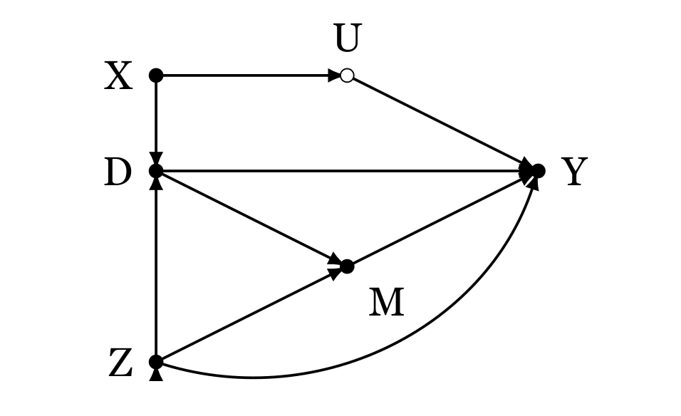

```{r, warning=FALSE, message=FALSE}
rm(list = ls())

library(dplyr)
library(ggdag)
library(ggplot2)
#install.packages("wooldridge")
library(wooldridge)
#install.packages("ggpubr")
library(ggpubr)
```


### Task 1 - Interpreting a causal graph [7 points in total]

Inspect the causal graph you see below (or attached in DAG.png) and answer the following questions:



(a) Replicate the DAG using `ggdag`! [2 Pts] 

```{r}
#creating a list

daggy <- list(
  x=c(X=0, U=1, M=1, Y=3, Z=0, D=0),
  y=c(X=0, D=-1, Y=-1, M=-2, Z=-3, U=0)
)

#using all tie approach
dag <- dagify(D~X+Z,
              U~X,
              Y~Z+M+D+U,
              M~D+Z,coords = daggy)
ggdag(dag)
```

(b) Say you are interested in determining the causal effect of D on Y. What are back-door paths in this case? [2 Pts]

<div style="color:blue">
The back door paths are 
D<-X->U->Y
D<-Z->M->Y
D<-Z->Y

</div>

(b) What variables could you condition on to satisfy the backdoor criterion? [2 Pts]

<div style="color:blue">

I would condition on X and Z to satisfy the backdoor criterion that requires me to close all the open non causal paths.

</div>

(c) Now assume that you could observe U. Would this affect the validity of your solution in (b)? Would there be another solution? [1 Pt]

<div style="color:blue">

If I could observe U this would not affect the validity of my solution in b because as long as we control for x, we do not need to have u. Yes, there will be another solution of controlling for u because we still are controlling for x.

#would there be another solution

</div>

<br>
========================================================


### Task 2 - Unemployment Rate and Turnout [9 points in total]

In the study "Economic Discontent as a Mobilizer: Unemployment and Voter Turnout", Burden and Wichowsky argue that "a worsening economy has a disruptive effect that prods worried citizens to voice concern and seek remedies." They investigate the effect the unemployment rate has on voter turnout at the county level in US presidential elections from 1976 to 2008. Please find the data they used for their study in BWJOP.RDS and a Codebook at the end of the assignment.

  
(a) Estimate the following model: Turnout = beta0 + beta1*Unemploy_County + beta2*PcntBlack + u [1 Pt]

```{r}
ec_disc <- readRDS("BWJOP.RDS")

#estimating the model
reg1 <- lm(Turnout~Unemploy_County+PcntBlack, data = ec_disc)
summary(reg1)
```

(b) What is the estimated change in the turnout rate with an increase of the unemployment rate by 4 percentage points, holding the % blacks in a county constant? And what is the estimated turnout rate for an unemplyoment rate of 8% in a county with 10% black population? Do your findings align with the argument of the authors? [3 Pts]

Holding % black constant
```{r}
Turnout = 61.315829*0 + -0.146778*4 + -0.246804*0
Turnout
```

With 10% black population
```{r}
Turnout = 61.315829 + -0.146778*8 + -0.246804*10
Turnout
```

The results do not align with the argument of the authors because the author posits that higher rates of unemployement tend to increase turnout.

(c) What percentage of the variation in turnout rate is explained by the two variables? Is this important for the interpretation of the causal effect of unemplyoment on turnout? [2 Pts]

<div style="color:blue">

The percentage of the variation explained by the two variables is 11.39%. No, this is not important for the interpretation of the causal effect. This is because if we have included the most important variables in our model as guided by our theory, we do not need to worry about how small our R Squared is.

</div>

(d) Now extend the model by adding more covariates. Your goal is to estimate the causal effect of unemployment on turnout. Choose additional covariates accordingly, justify your choice, and explain potential differences between the new beta_1 and the old beta_1! [3 Pts]

I will extend the model by adding the following covariates with subsequent reasons

ZPcntHSGrad: Because the higher educated a person is, the more likely they are going to vote. This logarithimic variable will also control for outliers.

Unemploy_State: Because the magnitude of unmeployed people in a state affects their decisions to vote.

closeness: The closer it is to voting affects people's turnout rate to voting.

```{r, message=FALSE}
reg2 <- lm(Turnout~Unemploy_County+PcntBlack+ZPcntHSGrad+Unemploy_State+closeness, data = ec_disc)

library(stargazer)

stargazer(reg1, reg2,
          type = "text",
          title = "Compartive",
          omit.stat=c("f", "ser"),
          out = "qn_2d.txt")
```

The new beta1 has a positive effect towards increasing turnout. The higher the unemployment rate leads to, on average, an increase in turnout. This is consistent to the findings of the paper. It also resonates in real life that when more people get unemployed, they are more likely to vote in elections to pick a candidate that is likely to change the status quo.

<br>
========================================================


### Task 3 - Simulating post-treatment bias in R [5 points in total]

Demonstrate how post-treatment bias can diminish the estimated full effect of a normally distributed variable X (mean 0, sd 1) on Y. X is supposed to affect Y both directly and through mediator M. The relationship between all variables can assumed to be linear. To demonstrate, simulate the data-generating process using R. Then, show the bias by comparing the estimates of linear models, once with, once without controlling for M!


```{r}
# X - 1000 observations with mean 0 and sd 1
X <- rnorm(1000, 0, 1)
M <- rnorm(1000, 0, 0.8) + 3*X
Y <- rnorm(1000, 0, 0.4) + 4*X + 2.8*M

dat <- data.frame(X,Y,M, stringsAsFactors = FALSE)

```


Regressing when controlling for M
```{r}
reg_cont <- lm(Y~X, data = dat)
summary(reg_cont)
```

Put it graphically on a ggplot
```{r}
datPlot <- ggplot(dat, aes(x = X, y = Y, col=M)) +
  geom_point() + 
  xlab("Variable X") + 
  ylab("Variable Y") +
  geom_smooth(method = "lm", se = FALSE)

datPlot
```

Without conditioning for M
```{r}
reg_nocont <- lm(Y~X+M, data = dat)
summary(reg_nocont)
```

Put in graphically on a ggplot
```{r}
datPlot <- ggplot(dat, aes(x = X, y = Y)) +
  geom_point() + 
  xlab("Variable X") + 
  ylab("Variable Y") +
  geom_smooth(method = "lm", se = FALSE)

datPlot
```
Comparing the two models through the Stargazer function
```{r}
stargazer(reg_cont, reg_nocont,
          type = "text",
          title = "Compartive",
          omit.stat=c("f", "ser"),
          out = "qn_3.txt")

```

<br>
========================================================

### Codebook for BWJOP.RDS

Variable Name | Description
--------------- | -----------------------------
"FIPS_County" | County Code
"county" | County Name
"state" | Stata Name
"Turnout" | Turnout rate at presidential election
"Turnout_Lag" | Turnout rate at last election
"Unemploy_County" | County unemplyoment rate
"Unemploy_State" | State unemplyoment rate
"ZPcntHSGrad" | Logarithm of % high college graduates in the county
"closeness" | Presidential campaign competitiveness
"pop" | Population
"PcntBlack" | % Black in the county
"AdjIncome" | Median income in the county
"SenElection" | Simultaneous senatorial election
"GubElection" | Simultaneous gubernatorial election
"Yr*"       | A set of dummies to indicate presidential election year